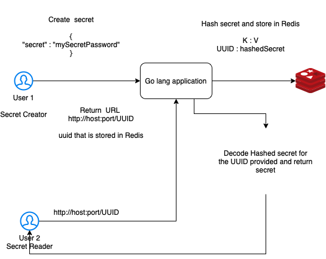

# one-time-secret-heroku
A simple Go lang app which helps is sharing a one time password with others.




- Added 2 modules server and client 
   * server - go modules for rest api 
   * client - react js - `To be added` 


### Infrastrcture setup 

- Setup docker 
    * Mac - setup docker desktop community edition 
    * Run redis on docker. An in-memory database. We will use `redis` to store secrets and we will also leverage `redis EXPIRE` to delete secrets based on timeout. 
    
    ```
    docker run -p 6379:6379 -d redis 
    docker exec -it <docker image id> /bin/sh
    # redis-cli -- to access redis CLI
    ```
